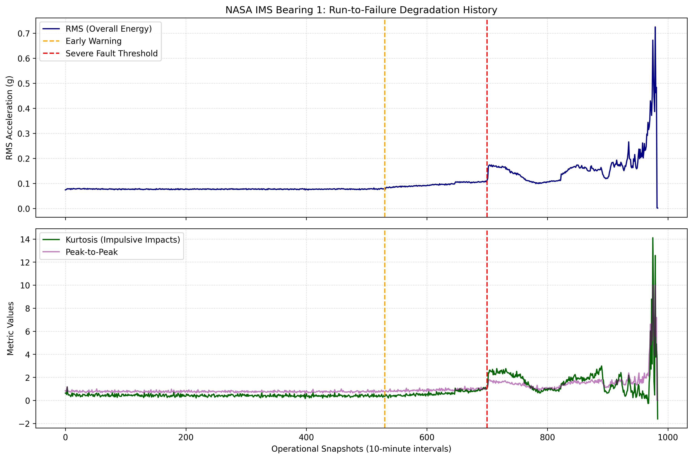
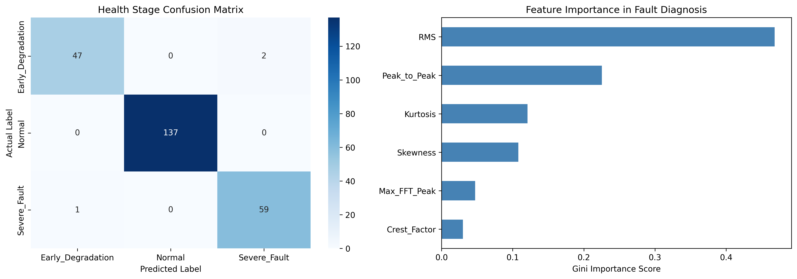

# Predictive Maintenance for Industrial Bearings

An end-to-end machine learning and vibration signal processing pipeline to detect fault initiation, classify operational health stages, and predict Remaining Useful Life (RUL) using the NASA IMS Bearing Dataset.

---

##  Project Overview
Industrial rotating machinery often undergoes degradation that begins as microscopic subsurface spalls before leading to catastrophic mechanical failure. This project processes raw continuous accelerometer signals to:
1. Extract time-domain and frequency-domain (FFT) statistical health indicators.
2. Track the run-to-failure degradation trajectory of a bearing operating at 2000 RPM.
3. Classify health stages (`Normal`, `Early Degradation`, `Severe Fault`) with **99% accuracy**.
4. Estimate Remaining Useful Life (RUL) with an **$R^2$ score of 0.81**.

---

##  Dataset: NASA IMS Bearing Run-to-Failure
* **Source:** NASA Intelligent Maintenance Systems (IMS) Center.
* **Test Setup:** 4 Rexnord ZA-2115 double-row bearings installed on a shared shaft loaded at 6000 lbs radial load, spinning at 2000 RPM.
* **Sampling Rate:** 20.48 kHz (20,480 data points per 1-second snapshot, recorded every 10 minutes).
* **Test 2 Horizon:** 984 operational snapshots until an outer-race spall defect developed on Bearing 1.

---

##  Feature Engineering & Signal Processing
Vibration time-series were converted into statistical kinematics and spectral features:
* **Root Mean Square (RMS):** Measures overall vibration energy and catastrophic wear progression.
* **Kurtosis:** Detects impulsive impact shocks when rolling elements strike outer-race spalls.
* **Peak-to-Peak (PTP):** Dynamic range of acceleration amplitudes.
* **Crest Factor:** Ratio of peak amplitude to RMS (flags high-energy shock waves).
* **Skewness:** Measures asymmetry of the vibration distribution profile.
* **Max FFT Spectral Peak:** Identifies fundamental harmonics and outer-race pass frequency energy.

---

##  Degradation History & Health Stages
The bearing's lifecycle is divided into three distinct operational regimes:
* **Normal Operation (Cycles 0 – 529):** Low vibration baseline (RMS < 0.08 g, Kurtosis ≈ 0).
* **Early Degradation (Cycles 530 – 699):** Micro-defect initiation; Kurtosis spikes sharply while RMS remains stable.
* **Severe Fault (Cycles 700 – 983):** Exponential rise in RMS (> 0.15 g up to catastrophic failure at 0.45 g).



---

##  Machine Learning Models & Results

### 1. Fault Stage Classification (Random Forest Classifier)
* **Accuracy:** 99%
* **Confusion Matrix & Metrics:**
  * `Normal`: Precision = 1.00, Recall = 1.00, F1-Score = 1.00
  * `Early_Degradation`: Precision = 0.98, Recall = 0.96, F1-Score = 0.97
  * `Severe_Fault`: Precision = 0.97, Recall = 0.98, F1-Score = 0.98

### 2.Remaining Useful Life (RUL) Regression (Random Forest Regressor)
* **R² Score:** 0.8113
* **RMSE:** 118.26 cycles (~19.7 operational hours)



---

## Tech Stack & Libraries
* **Language:** Python 3.10+
* **Data Manipulation:** `pandas`, `numpy`
* **Signal Processing:** `scipy.stats`, `scipy.fft`
* **Machine Learning:** `scikit-learn`
* **Visualization:** `matplotlib`, `seaborn`


## Live Dashboard Usage

To launch the interactive dashboard locally:

```bash
python -m streamlit run app.py
